# Q-SFTP: Quantum-Safe Secure File Transfer Protocol

## 1. Problem Statement
Traditional secure file transfer protocols (like SFTP/SCP) rely on classical cryptographic algorithms such as RSA and Diffie-Hellman, which are vulnerable to future quantum computer attacks (Shor's Algorithm). **Q-SFTP** addresses this by implementing a **Post-Quantum Cryptography (PQC)** handshake, ensuring long-term data security against "Harvest Now, Decrypt Later" threats.

## 2. Tech Stack
*   **Language**: Python 3.x
*   **Web Framework**: Flask (for Web GUI)
*   **Key Encapsulation (KEM)**: [Kyber512](https://pypi.org/project/kyber-py/) (NIST PQC Winner)
*   **Digital Signatures**: [Dilithium2](https://pypi.org/project/dilithium-py/) (NIST PQC Winner)
*   **Symmetric Encryption**: AES-256-GCM
*   **Integrity Verification**: SHA-256 Hashing
*   **Frontend**: HTML5, CSS3 (Variables for Theming), Vanilla JavaScript

## 3. System Architecture


### PQC Handshake Flow


### RBAC & Storage Architecture

```mermaid
graph LR
    subgraph "Users"
        Admin["👑 Administrator"]
        Standard["👤 Standard"]
        Guest["👁️ Guest"]
    end

    subgraph "Permissions"
        R["READ"]
        W["WRITE"]
        D["DELETE"]
    end

    subgraph "Storage (ServerStorage/)"
        AdminDir["admin/ (Private)"]
        BobDir["bob/ (Private)"]
        Shared["shared/ (Global)"]
    end

    Admin --> R & W & D
    Standard --> R & W
    Guest --> R

    R -->|"List & Download"| AdminDir
    R -->|"List & Download"| Shared
    W -->|"Upload & Create Dir"| Shared
    W -->|"Upload & Create Dir"| AdminDir
    D -->|"Delete Files/Dirs"| AdminDir
    D -->|"Delete Files/Dirs"| Shared
```



## 4. Key Features

### 🛡️ Core Security & Privacy
*   **Quantum-Safe Security**: Kyber512 for key exchange + Dilithium2 for authentication.
*   **File Integrity Verification**:
    *   **Upload Verification**: Computes SHA-256 hash before upload and verifies against server's received file.
    *   **Download Verification**: Automatically verifies data integrity upon download.
    *   **Tamper Detection**: Visual alerts if a file has been modified on the server.
    *   **Hash Registry**: Secure database tracking all file hashes.
*   **Metadata Stripping (Privacy)**:
    *   **Images (JPG/PNG)**: Removes EXIF data (GPS, Camera info).
    *   **PDFs**: Removes Author, Creator, Dates.
    *   **Docs**: Removes personal identifiers.

### 💻 Advanced Web GUI
*   **Modern Dashboard**: Dual-pane interface (Local vs. Remote) with Dark/Light modes.
*   **Smart Transfer Manager**:
    *   **Bulk Operations**: Upload and download multiple files simultaneously.
    *   **Drag & Drop**: Intuitive file selection.
    *   **Pause & Resume**: Control active uploads.
*   **Visual Feedback**:
    *   Real-time progress bars.
    *   Stacked notification system for multiple downloads.
    *   **Visual Integrity Check**: Modal to inspect file hashes and verification status.

### 🔐 Access Control (RBAC)
*   **Multi-User Support**: Concurrent access for multiple users (e.g., `bob`, `alice`).
*   **Role-Based Permissions**:
    *   **Administrator**: Full system access, user management.
    *   **Standard**: Read/Write access to personal storage.
    *   **Guest**: Read-only access.
*   **Directory Isolation**: Each user gets a private, encrypted storage vault.

### 📂 Shared Folders
*   **Global Shared Directory**: A `shared/` folder visible to all authenticated users.
*   **Collaborative Storage**: Admin and Standard users can upload files and create subdirectories in `shared/`.
*   **Guest Read Access**: Guest users can browse and download from the shared folder but cannot modify it.
*   **UI Indicators**: Shared folder displays with a distinct icon and "(Shared)" label.

## 5. Docker Deployment

> 🐳 **Docker Hub**: [`joserohit264/q-sftp`](https://hub.docker.com/r/joserohit264/q-sftp)

### Pull & Run (Quickest)
```bash
docker pull joserohit264/q-sftp:latest
docker run -d --name q-sftp -p 5000:5000 -p 8888:8888 joserohit264/q-sftp:latest
```
Access at `http://localhost:5000` — login: `admin` / `admin`

### Using Docker Compose
```bash
docker-compose up -d
```

### Build from Source
```bash
docker build -t joserohit264/q-sftp:latest .
docker run -d --name q-sftp -p 5000:5000 -p 8888:8888 joserohit264/q-sftp:latest
```

### Push Updates to Docker Hub
```bash
docker login -u joserohit264
docker build -t joserohit264/q-sftp:latest .
docker push joserohit264/q-sftp:latest
```

## 6. Quick Start (Windows)
The easiest way to run the application is using the included batch script:

1.  **Double-click `start_q_sftp.bat`** in the project root.
2.  This will:
    *   Start the Secure Server (Port 8888).
    *   Start the Web Client (Port 5000).
    *   Open your browser to the Login Page (`http://127.0.0.1:5000`).
3.  **Login Credentials**:
    *   **Default User**: `admin` / `admin` (or create new users via script)
    *   **Host**: `127.0.0.1`
    *   **Port**: `8888`

## 7. Manual Setup & Usage

### Prerequisites
*   Python 3.8+

**1. Create & Activate Virtual Environment:**
```bash
# Windows
python -m venv venv
venv\Scripts\activate

# Linux/Mac
python3 -m venv venv
source venv/bin/activate
```

**2. Install Dependencies:**
```bash
pip install -r requirements.txt
```

### Running Manually
**1. Start the Server:**
```bash
python Codes/Handshake/handshake_server.py
```

**2. Start the Web Client:**
```bash
python Codes/WebApp/app.py
```

**3. Access the Interface:**
Open your browser and navigate to: `http://127.0.0.1:5000`

## 8. requirements.txt
Essential packages required to run the system:
```txt
flask
cryptography
kyber-py
dilithium-py
bcrypt
schedule
Pillow>=10.0.0      # For Image Metadata Stripping
PyPDF2>=3.0.0       # For PDF Metadata Stripping
python-docx>=1.1.0  # For Word Doc Metadata Stripping
```

## 9. Project Structure
*   `Codes/Handshake/`: Core PQC protocol server & client logic.
*   `Codes/WebApp/`: Flask application, templates, and static assets.
*   `Codes/CA/`: Certificate Authority tools for generating and signing certificates.
*   `Codes/Data/`: Storage for Hash Registry and Activity Logs.
*   `ServerStorage/`: Root directory for secure per-user file storage + global shared directory.

## 10. User Management
The system includes tools to manage users and demonstrate RBAC.

### Create a New User
Use `create_user.py` to generate credentials and register a user.
```bash
# Usage: python create_user.py <username> <role> <Common_Name>
python create_user.py bob standard BobClient
```
*   **Roles**: `administrator`, `standard`, `guest`.

### Privacy Configuration
Edit `Codes/WebApp/privacy_config.json` to toggle features:
```json
{
  "metadata_scrubbing": {
    "enabled": true,
    "file_types": ["jpg", "jpeg", "png", "gif", "pdf", "docx"]
  },
  "ip_anonymization": {
    "enabled": true
  }
}
```
