# Q-SFTP: Quantum-Safe Secure File Transfer Protocol

<p align="center">
  <strong>A post-quantum cryptographic file transfer system with a modern web interface</strong><br>
  Kyber512 · Dilithium2 · AES-256-GCM · BLAKE2b · RBAC · Resumable Transfers
</p>

---

## Table of Contents

1. [Problem Statement](#1-problem-statement)
2. [Tech Stack](#2-tech-stack)
3. [System Architecture](#3-system-architecture)
4. [PQC Handshake Protocol](#4-pqc-handshake-protocol)
5. [Key Features](#5-key-features)
   - [Quantum-Safe Cryptography](#-quantum-safe-cryptography)
   - [File Integrity Verification](#-file-integrity-verification-blake2b)
   - [Resumable File Transfers](#-resumable-file-transfers)
   - [Malicious File Protection](#-malicious-file-protection)
   - [Metadata Stripping & Privacy](#-metadata-stripping--privacy)
   - [Role-Based Access Control](#-role-based-access-control-rbac)
   - [Shared Folders](#-shared-folders)
   - [Activity Logging & Audit Trail](#-activity-logging--audit-trail)
   - [Modern Web GUI](#-modern-web-gui)
   - [Admin Panel](#-admin-panel)
6. [Detailed Flow Diagrams](#6-detailed-flow-diagrams)
7. [Project Structure](#7-project-structure)
8. [Module Reference](#8-module-reference)
9. [API Reference](#9-api-reference)
10. [Docker Deployment](#10-docker-deployment)
11. [Quick Start (Windows)](#11-quick-start-windows)
12. [Manual Setup & Usage](#12-manual-setup--usage)
13. [User Management](#13-user-management)
14. [Configuration Reference](#14-configuration-reference)
15. [Security Considerations](#15-security-considerations)

---

## 1. Problem Statement

Traditional secure file transfer protocols (SFTP/SCP) rely on classical cryptographic algorithms such as RSA and Diffie-Hellman, which are vulnerable to future quantum computer attacks (Shor's Algorithm). **Q-SFTP** addresses this by implementing a **Post-Quantum Cryptography (PQC)** handshake using NIST-standardized algorithms, ensuring long-term data security against **"Harvest Now, Decrypt Later"** threats.

Q-SFTP provides:
- **Quantum-resistant key exchange** via Kyber512 (CRYSTALS-Kyber)
- **Quantum-resistant authentication** via Dilithium2 (CRYSTALS-Dilithium)
- **Symmetric encryption** via AES-256-GCM with HKDF-derived session keys
- **File integrity** via BLAKE2b-256 hashing with a persistent hash registry
- **Resumable transfers** via chunked upload/download with persistent state
- A **modern web GUI** abstracting all cryptographic complexity behind an intuitive FTP-style interface

---

## 2. Tech Stack

| Layer | Technology |
|-------|-----------|
| **Language** | Python 3.8+ |
| **Web Framework** | Flask 3.x |
| **Key Encapsulation (KEM)** | [Kyber512](https://pypi.org/project/kyber-py/) (NIST PQC Standard) |
| **Digital Signatures** | [Dilithium2](https://pypi.org/project/dilithium-py/) (NIST PQC Standard) |
| **Symmetric Encryption** | AES-256-GCM (via `cryptography` library) |
| **File Integrity** | BLAKE2b-256 (native `hashlib`) |
| **Client Hashing** | [blakejs](https://github.com/nicolo-ribaudo/blakejs) |
| **Key Derivation** | HKDF-SHA256 |
| **Auth Database** | SQLite (via `sqlite3`) |
| **Privacy** | Pillow (images), PyPDF2 (PDFs), python-docx (Word) |
| **Frontend** | HTML5, CSS3 (Variables + Dark/Light theming), Vanilla JavaScript |
| **Containerization** | Docker + Docker Compose |

---

## 3. System Architecture


---

## 4. PQC Handshake Protocol

The Q-SFTP handshake establishes a quantum-resistant encrypted channel in **4 phases**:

```mermaid
sequenceDiagram
    participant C as Client (Flask App)
    participant S as Handshake Server
    participant CA as Certificate Authority

    rect rgb(45, 55, 72)
    Note over C,S: Phase 1 — Hello Exchange
    C->>S: ClientHello (Certificate, Nonce, Timestamp)
    S->>S: Verify Client Certificate (via CA public key)
    S->>S: Check Timestamp Freshness (< 30s window)
    S->>C: ServerHello (Certificate, Kyber PK, Nonce, Dilithium Signature)
    C->>C: Verify Server Signature & Certificate
    end

    rect rgb(44, 82, 52)
    Note over C,S: Phase 2 — Key Exchange (Kyber512)
    C->>C: Encapsulate shared secret with Server's Kyber PK
    C->>S: ClientKeyShare (Kyber Ciphertext)
    S->>S: Decapsulate → Shared Secret
    Note over C,S: Both parties now hold identical shared secret
    end

    rect rgb(92, 61, 93)
    Note over C,S: Phase 3 — Mutual Authentication
    C->>C: Compute Transcript Hash (SHA-256 over all messages)
    C->>S: ClientFinished (Dilithium Signature over Transcript)
    S->>S: Verify Signature → Mutual Authentication Complete
    Note over C,S: Derive Session Key via HKDF-SHA256
    end

    rect rgb(90, 55, 40)
    Note over C,S: Phase 4 — Secure Data Transfer
    C->>S: Encrypted Commands (ListFiles, Upload, Download, etc.)
    S->>C: Encrypted Responses (via AES-256-GCM)
    Note over C,S: All transfers chunked and resumable
    end
```



### Key Derivation

```
Shared Secret (from Kyber512 encapsulation)
    │
    ▼
HKDF-SHA256(salt = SHA-256(client_nonce ‖ server_nonce),
            info = b"Q-SFTP-SESSION-KEY")
    │
    ▼
Session Key (256-bit) → Used for AES-256-GCM encryption
```

---

## 5. Key Features

### 🛡️ Quantum-Safe Cryptography

| Algorithm | Purpose | Standard |
|-----------|---------|----------|
| **Kyber512** | Key Encapsulation Mechanism (KEM) | NIST FIPS 203 |
| **Dilithium2** | Digital Signatures | NIST FIPS 204 |
| **AES-256-GCM** | Symmetric Authenticated Encryption | NIST SP 800-38D |
| **HKDF-SHA256** | Key Derivation | RFC 5869 |
| **BLAKE2b-256** | File Integrity Hashing | RFC 7693 |

All cryptographic operations happen transparently — users interact only with the web GUI.

---

### 🔍 File Integrity Verification (BLAKE2b)

Q-SFTP maintains a **persistent hash registry** (`hash_registry.json`) that tracks BLAKE2b-256 hashes for every uploaded file.

**Upload Verification Flow:**
1. Client computes BLAKE2b hash of file in-browser (via `blakejs`)
2. Hash is sent alongside the file data
3. Server independently computes hash of received content
4. Both hashes are compared — mismatch triggers an alert
5. Final hash is registered in the hash registry

**Download Verification Flow:**
1. Server retrieves stored hash from registry
2. Server computes current hash of the file on disk
3. If hashes match → `VERIFIED` status
4. If mismatch → `TAMPERED` warning (user prompted before download)
5. If file not in registry → `UNTRACKED` info

**Background Integrity Checker:**
- Runs periodically (configurable interval)
- Scans all registered files against their stored hashes
- Detects unauthorized modifications
- Backward-compatible: supports both `hash_blake2b` and `hash_sha256` registry keys

---

### 📦 Resumable File Transfers

Files are transferred in **256KB encrypted chunks** with persistent state tracking, enabling pause/resume even after connection interruptions or app restarts.

```mermaid
sequenceDiagram
    participant B as Browser (app.js)
    participant F as Flask (app.py)
    participant TM as TransferManager
    participant HS as Handshake Server
    participant D as Disk (ServerStorage)

    rect rgb(45, 55, 72)
    Note over B,D: Upload — Initialization
    B->>F: POST /api/upload/init {filename, total_size, file_hash}
    F->>TM: init_transfer() — check for existing session
    TM-->>F: {transfer_id, chunk_size, resume_offset}
    F-->>B: Transfer session (new or resumed)
    B->>B: Save {transfer_id, offset} to localStorage
    end

    rect rgb(44, 82, 52)
    Note over B,D: Upload — Chunk Loop
    loop Each 256KB chunk
        B->>B: file.slice(offset, offset + 256KB)
        B->>F: POST /api/upload/chunk {transfer_id, offset, chunk}
        F->>F: Encrypt chunk (AES-256-GCM)
        F->>HS: ChunkUpload {encrypted chunk, offset, IsFinal}
        HS->>HS: Decrypt chunk
        HS->>HS: File validation (first chunk only)
        HS->>D: Write to filename.part at offset
        HS-->>F: ChunkAck {BytesReceived}
        F->>TM: update_progress(transfer_id, new_offset)
        F-->>B: {bytes_transferred}
        B->>B: Update localStorage + progress bar
    end
    end

    rect rgb(90, 55, 40)
    Note over B,D: Upload — Finalization
    HS->>D: Rename filename.part → filename
    B->>F: POST /api/upload/complete {transfer_id}
    F->>F: Register BLAKE2b hash
    F->>TM: complete_transfer(transfer_id)
    F-->>B: {success}
    B->>B: Remove from localStorage
    end
```



**Pause/Resume Mechanics:**
- **Pause**: Saves `{transfer_id, offset, total_size, file_hash}` to `localStorage`
- **Resume (same session)**: Continues chunk loop from saved offset
- **Resume (after restart)**: Server-side `TransferManager` detects existing active session with matching filename/username/path — returns the saved `resume_offset`
- **Stale cleanup**: Transfers inactive for >24 hours are automatically purged

**Download Flow:**
- Uses the same chunked approach: `/api/download/init` → `/api/download/chunk` (loop)
- Chunks are assembled client-side into a Uint8Array
- BLAKE2b hash is computed on the assembled file for integrity verification
- Progress tracked in `localStorage` for cross-session resume

---

### 🛑 Malicious File Protection

The `FileValidator` implements a **security-first blacklist approach**:

**Blocked Extensions:**
```
.exe  .dll  .scr  .com  .msi  .cmd  .vbs  .vbe
.wsf  .wsh  .pif  .cpl  .inf  .reg  .sys  .drv  .ocx
```

**Magic Number Validation:**
For known binary formats (JPG, PNG, GIF, PDF, ZIP, DOCX, MP3, MP4, AVI, MKV, FLAC, OGG, RAR, 7Z, GZ, BMP, WAV), the validator verifies that file content starts with the correct magic bytes — preventing extension spoofing attacks.

**Validation Points:**
- Executed on the handshake server during file receive
- For chunked uploads: validated on the first chunk only (security headers exist in file preamble)
- Blocked files are rejected with a security reason message

---

### 🔒 Metadata Stripping & Privacy

The `PrivacyManager` automatically removes personally identifiable information before files are stored on the server:

| File Type | Stripped Metadata |
|-----------|-------------------|
| **Images** (JPG, PNG, GIF) | EXIF data (GPS coordinates, camera info, timestamps, software) |
| **PDFs** | Author, Creator, Producer, Creation/Modification dates |
| **Word Docs** (DOCX) | Author, Company, Last Modified By, Revision count |

**Additional Privacy Features:**
- **IP Anonymization**: Client IP addresses are hashed with a daily rotating salt (SHA-256) before storage
- **Configurable**: Controlled via `privacy_config.json` — features can be individually toggled
- **Metadata Log**: All scrubbing operations are logged for audit with anonymized user identifiers

---

### 🔐 Role-Based Access Control (RBAC)

```mermaid
graph LR
    subgraph "User Roles"
        Admin["👑 Administrator"]
        Standard["👤 Standard"]
        Guest["👁️ Guest"]
    end

    subgraph "Permissions"
        ALL["ALL"]
        RWD["READ + WRITE + DELETE"]
        RO["READ"]
    end

    subgraph "Storage Layout"
        AdminDir["admin/<br>(Private)"]
        BobDir["bob/<br>(Private)"]
        Shared["shared/<br>(Global)"]
    end

    Admin --> ALL
    Standard --> RWD
    Guest --> RO

    ALL -->|"Full Control"| AdminDir
    ALL -->|"Full Control"| Shared
    RWD -->|"Browse + Upload + Delete"| BobDir
    RWD -->|"Browse + Upload"| Shared
    RO -->|"Browse + Download Only"| Shared
```



**Implementation Details:**
- **Authentication Database**: SQLite with `users` and `roles` tables
- **Password Storage**: PBKDF2-HMAC-SHA256 with random 32-byte salt (100,000 iterations)
- **Certificate Binding**: Each user is bound to a unique Dilithium certificate subject (e.g., `CN=Bob,O=QuantumSFTP`)
- **Permission Checking**: Enforced at the handshake server level before every file operation
- **Directory Isolation**: Each user gets an isolated directory under `ServerStorage/<username>/`

---

### 📂 Shared Folders

- **Global Shared Directory**: A `shared/` folder visible to all authenticated users
- **Collaborative Storage**: Admin and Standard users can upload files and create subdirectories
- **Guest Read Access**: Guest users can browse and download but cannot modify
- **UI Indicators**: Shared folder displays with a distinct icon and "(Shared)" label
- **Subdirectory Support**: Full nested directory structure within shared space

---

### 📋 Activity Logging & Audit Trail

The `ActivityLogger` provides comprehensive audit logging stored in `activity_logs.db`:

**Logged Events:**

| Event | Details Captured |
|-------|-----------------|
| **Login/Logout** | Username, success/failure, anonymized IP, timestamp |
| **File Upload** | Username, filename, file size, anonymized IP |
| **File Download** | Username, filename, anonymized IP |
| **File Deletion** | Username, filename, anonymized IP |
| **Directory Creation** | Username, directory name, anonymized IP |
| **User Management** | Admin username, target user, role changes |

**Features:**
- Thread-safe SQLite operations
- IP anonymization with daily rotating salt
- Filterable log retrieval (by user, action, with pagination)
- Per-user statistics (upload count, download count, last activity)
- Automatic cleanup of logs older than 30 days

---

### 💻 Modern Web GUI

- **Dashboard**: Dual-pane interface (Local path info + Remote file browser)
- **Dark/Light Modes**: Toggle with CSS variable theming
- **Drag & Drop Upload**: Intuitive file selection via dropzone
- **Real-time Progress**: Chunk-level progress bars for uploads
- **Stacked Notifications**: Download status with integrity check buttons
- **Bulk Operations**: Select multiple files for batch download or delete
- **Breadcrumb Navigation**: Click-through path navigation for remote directories
- **Hash Verification Modal**: Visual inspection of BLAKE2b hashes and verification status

---

### 🔧 Admin Panel

The admin panel (accessible to Administrator role only) provides:

| Feature | API Endpoint |
|---------|-------------|
| **Create User** | `POST /api/admin/users` |
| **Delete User** | `DELETE /api/admin/users/<username>` |
| **Update Role** | `PUT /api/admin/users/<username>/role` |
| **Reset Password** | `PUT /api/admin/users/<username>/reset-password` |
| **View Activity Logs** | `GET /api/logs` |
| **User Statistics** | `GET /api/logs/user/<username>` |
| **Integrity Status** | `GET /api/integrity/status` |
| **Trigger Integrity Check** | `POST /api/integrity/check` |
| **Hash Registry Stats** | `GET /api/integrity/stats` |

---

## 6. Detailed Flow Diagrams

### Complete Upload Flow (End-to-End)


### Complete Download Flow (End-to-End)


### Certificate Authority Flow


### Authentication & Session Flow

```mermaid
sequenceDiagram
    participant B as Browser
    participant F as Flask App
    participant UM as User Manager
    participant HS as Handshake Server
    participant AM as Auth Manager

    B->>F: POST /api/login {username, password}
    F->>UM: Verify credentials (PBKDF2)
    UM-->>F: {valid, role}
    F->>F: Create Flask session {username, role}
    F-->>B: Login success + redirect

    B->>F: POST /api/connect {host, port}
    F->>F: Load user's Dilithium cert + private key
    F->>HS: TCP Connect → PQC Handshake (4 phases)
    HS->>AM: get_user_by_subject(cert_subject)
    AM-->>HS: User object with role
    HS-->>F: Handshake complete, session key established
    F-->>B: Connected — ready for file operations

    B->>F: POST /api/upload/chunk
    F->>HS: ChunkUpload (encrypted with session key)
    HS->>AM: check_permission(username, 'WRITE')
    AM-->>HS: Allowed/Denied
    HS-->>F: ChunkAck / Permission Denied
    F-->>B: Success / Error
```



---

## 7. Project Structure

```
Q_SFTP/
├── README.md                          # This file
├── requirements.txt                   # Python dependencies
├── Dockerfile                         # Docker image definition
├── docker-compose.yml                 # Docker Compose configuration
├── docker-entrypoint.sh               # Container startup script
├── start_q_sftp.bat                   # Windows quick-start script
├── start_q_sftp.sh                    # Linux/Mac quick-start script
├── create_user.py                     # CLI tool: create new users
│
├── Codes/
│   ├── CA/                            # Certificate Authority
│   │   ├── ca_tool.py                 # CA key generation + cert signing
│   │   ├── certs/                     # Issued certificates (.json)
│   │   ├── keys/                      # Key pairs (Dilithium2 + Kyber512)
│   │   └── tests/                     # CA unit tests
│   │
│   ├── Handshake/                     # PQC Protocol Server
│   │   ├── handshake_server.py        # Server: PQC handshake + file ops
│   │   ├── handshake_client.py        # Client: PQC handshake state machine
│   │   ├── auth_manager.py            # RBAC: users, roles, permissions
│   │   ├── file_validator.py          # Security: extension blacklist + magic numbers
│   │   ├── utils.py                   # Crypto utilities (AES-GCM, etc.)
│   │   ├── certs/                     # Active certificates
│   │   ├── keys/                      # Active key pairs
│   │   └── users.db                   # SQLite: user/role database
│   │
│   ├── WebApp/                        # Flask Web Application
│   │   ├── app.py                     # Main Flask app (all routes)
│   │   ├── user_manager.py            # Web login auth (PBKDF2)
│   │   ├── hash_verifier.py           # BLAKE2b hash computation + registry
│   │   ├── integrity_checker.py       # Periodic hash verification
│   │   ├── privacy_manager.py         # Metadata stripping (EXIF/PDF/DOCX)
│   │   ├── activity_logger.py         # Audit logging with IP anonymization
│   │   ├── transfer_manager.py        # Resumable transfer state persistence
│   │   ├── hash_config.json           # Hash algorithm configuration
│   │   ├── privacy_config.json        # Privacy feature toggles
│   │   ├── users.json                 # Web user credentials
│   │   ├── templates/                 # HTML templates
│   │   │   ├── index.html             # Main dashboard
│   │   │   ├── login.html             # Login page
│   │   │   └── admin.html             # Admin panel
│   │   └── static/                    # Static assets
│   │       ├── app.js                 # Client-side logic
│   │       └── style.css              # Responsive styling
│   │
│   └── Data/                          # Persistent Data
│       ├── hash_registry.json         # BLAKE2b file hash database
│       └── transfer_log.json          # Active transfer sessions
│
└── ServerStorage/                     # Secure File Storage Root
    ├── admin/                         # Admin's private directory
    ├── bob/                           # Bob's private directory
    └── shared/                        # Global shared directory
```

---

## 8. Module Reference

### Transport Layer (`Codes/Handshake/`)

| Module | Description |
|--------|-------------|
| `handshake_server.py` | TCP server on port 8888. Handles PQC handshake (Kyber512 + Dilithium2), message routing (`ListFiles`, `FileTransfer`, `ChunkUpload`, `ChunkDownload`, `CreateDir`, `Delete`), per-user directory isolation, RBAC enforcement, and file validation. |
| `handshake_client.py` | Client-side handshake state machine. Manages certificate loading, Kyber encapsulation, Dilithium signing, and session key derivation. Used by `app.py`. |
| `auth_manager.py` | SQLite-backed user/role database. Three default roles: `Administrator` (ALL), `Standard` (READ,WRITE,DELETE), `Guest` (READ). Password hashing via PBKDF2-HMAC-SHA256 (100k iterations). |
| `file_validator.py` | Blacklist-based file validation. Blocks 17 dangerous executable extensions. Validates magic numbers for 20+ binary formats to detect extension spoofing. |
| `utils.py` | Cryptographic utilities: AES-256-GCM encrypt/decrypt, message framing (length-prefixed JSON over TCP), nonce generation, and key management helpers. |

### Application Layer (`Codes/WebApp/`)

| Module | Description |
|--------|-------------|
| `app.py` | Main Flask application (~1200 lines). Routes for login, file operations, chunked uploads/downloads, admin panel, activity logs, and integrity checks. Bridges browser ↔ handshake server. |
| `transfer_manager.py` | Persistent transfer state manager. Stores active sessions in `transfer_log.json`. Supports init/resume, progress tracking, completion, failure, and stale cleanup (>24h). 256KB chunk size. |
| `hash_verifier.py` | BLAKE2b-256 hash computation engine. Supports file hashing, data hashing, hash comparison, and a persistent hash registry. Backward-compatible with SHA-256 entries. |
| `integrity_checker.py` | Background daemon that periodically re-hashes all registered files and compares against stored hashes. Reports `VERIFIED`, `TAMPERED`, or `MISSING` status. |
| `privacy_manager.py` | Metadata stripping for images (EXIF via Pillow), PDFs (PyPDF2), and Word docs (python-docx). IP anonymization with daily rotating salt. Configurable via `privacy_config.json`. |
| `activity_logger.py` | Thread-safe audit trail in SQLite. Logs logins, uploads, downloads, deletions, user management. IP anonymization. 30-day auto-cleanup. Per-user statistics. |
| `user_manager.py` | Web-layer authentication. Manages `users.json` for Flask login. Password verification via PBKDF2. |

### Certificate Authority (`Codes/CA/`)

| Module | Description |
|--------|-------------|
| `ca_tool.py` | Generates Dilithium2 key pairs, creates certificates (JSON format), signs client/server certificate requests. Self-signed CA root certificate. |

---

## 9. API Reference

### Authentication

| Method | Endpoint | Description |
|--------|----------|-------------|
| `POST` | `/api/login` | Authenticate user with username/password |
| `POST` | `/api/logout` | End session and disconnect |
| `GET` | `/api/status` | Get connection and session status |
| `POST` | `/api/connect` | Initiate PQC handshake with server |

### File Operations

| Method | Endpoint | Description |
|--------|----------|-------------|
| `POST` | `/api/remote/list` | List files in remote directory |
| `POST` | `/api/remote/read` | Read file from server (legacy, full-file) |
| `POST` | `/api/remote/mkdir` | Create remote directory |
| `POST` | `/api/remote/delete` | Delete remote file or directory |
| `POST` | `/api/upload` | Upload file (legacy, full-file) |
| `POST` | `/api/download` | Download file (legacy, full-file) |

### Chunked Transfers (Resumable)

| Method | Endpoint | Description |
|--------|----------|-------------|
| `POST` | `/api/upload/init` | Initialize/resume upload session |
| `POST` | `/api/upload/chunk` | Upload a single 256KB chunk |
| `POST` | `/api/upload/complete` | Finalize upload, register hash |
| `POST` | `/api/download/init` | Initialize/resume download session |
| `POST` | `/api/download/chunk` | Download a single 256KB chunk |

### Admin Panel

| Method | Endpoint | Description |
|--------|----------|-------------|
| `GET` | `/admin` | Admin dashboard page |
| `POST` | `/api/admin/users` | Create new user |
| `DELETE` | `/api/admin/users/<username>` | Delete user |
| `PUT` | `/api/admin/users/<username>/role` | Update user role |
| `PUT` | `/api/admin/users/<username>/reset-password` | Reset password |

### Monitoring

| Method | Endpoint | Description |
|--------|----------|-------------|
| `GET` | `/api/logs` | Get activity logs (filterable) |
| `GET` | `/api/logs/user/<username>` | Get per-user statistics |
| `GET` | `/api/integrity/status` | Get integrity checker status |
| `POST` | `/api/integrity/check` | Trigger manual integrity check |
| `GET` | `/api/integrity/stats` | Get hash registry statistics |

---

## 10. Docker Deployment

> 🐳 **Docker Hub**: [`joserohit264/q-sftp`](https://hub.docker.com/r/joserohit264/q-sftp)

### Pull & Run (Quickest)
```bash
docker pull joserohit264/q-sftp:latest
docker run -d --name q-sftp -p 5000:5000 -p 8888:8888 joserohit264/q-sftp:latest
```
Access at `http://localhost:5000` — login: `admin` / `admin`

### Using Docker Compose
```bash
docker-compose up -d
```

### Build from Source
```bash
docker build -t joserohit264/q-sftp:latest .
docker run -d --name q-sftp -p 5000:5000 -p 8888:8888 joserohit264/q-sftp:latest
```

### Push Updates
```bash
docker login -u joserohit264
docker build -t joserohit264/q-sftp:latest .
docker push joserohit264/q-sftp:latest
```

---

## 11. Quick Start (Windows)

1. **Double-click `start_q_sftp.bat`** in the project root
2. This will:
   - Start the Secure Server (Port 8888)
   - Start the Web Client (Port 5000)
   - Open your browser to `http://127.0.0.1:5000`
3. **Login Credentials**:
   - **Default User**: `admin` / `admin`
   - **Host**: `127.0.0.1`
   - **Port**: `8888`

---

## 12. Manual Setup & Usage

### Prerequisites
- Python 3.8+

**1. Create & Activate Virtual Environment:**
```bash
# Windows
python -m venv venv
venv\Scripts\activate

# Linux/Mac
python3 -m venv venv
source venv/bin/activate
```

**2. Install Dependencies:**
```bash
pip install -r requirements.txt
```

### Running Manually

**1. Start the Handshake Server:**
```bash
python Codes/Handshake/handshake_server.py
```

**2. Start the Web Application:**
```bash
python Codes/WebApp/app.py
```

**3. Access the Interface:**
Open your browser and navigate to: `http://127.0.0.1:5000`

---

## 13. User Management

### Create a New User
```bash
# Usage: python create_user.py <username> <role> <Common_Name>
python create_user.py bob standard BobClient
```

**Roles**: `administrator`, `standard`, `guest`

This script:
1. Generates a Dilithium2 key pair for the user
2. Creates a certificate signed by the CA
3. Adds the user to the `auth_manager` database
4. Creates the user's private directory in `ServerStorage/`

### Admin Panel User Management

Administrators can also manage users via the web interface at `/admin`:
- Create users with auto-generated quantum certificates
- Delete users and their certificates
- Change user roles
- Reset passwords
- View user activity statistics

---

## 14. Configuration Reference

### Hash Configuration (`hash_config.json`)
```json
{
  "algorithm": "BLAKE2b",
  "verify_on_upload": true,
  "verify_on_download": true,
  "auto_register": true,
  "integrity_check_interval": 3600
}
```

### Privacy Configuration (`privacy_config.json`)
```json
{
  "metadata_scrubbing": {
    "enabled": true,
    "file_types": ["jpg", "jpeg", "png", "gif", "pdf", "docx"]
  },
  "ip_anonymization": {
    "enabled": true
  }
}
```

### Transfer Settings (in `transfer_manager.py`)
| Parameter | Default | Description |
|-----------|---------|-------------|
| `CHUNK_SIZE` | 256 KB | Size of each encrypted chunk |
| `STALE_HOURS` | 24 | Hours before incomplete transfers are purged |
| `TRANSFER_LOG_PATH` | `Codes/Data/transfer_log.json` | Path to persistent transfer log |

---

## 15. Security Considerations

### Threat Model
Q-SFTP is designed to protect against:
- **Quantum adversaries**: Kyber512 + Dilithium2 resist Shor's Algorithm
- **Man-in-the-middle**: Mutual authentication via Dilithium signatures + CA-signed certificates
- **Replay attacks**: Timestamp freshness check (30s window) + unique nonces
- **Data tampering**: AES-256-GCM authenticated encryption + BLAKE2b hash verification
- **Metadata leakage**: Automatic stripping of EXIF/PDF/DOCX metadata before storage
- **IP tracking**: Daily rotating salt for IP anonymization in logs
- **Malicious uploads**: Extension blacklist + magic number validation on first chunk
- **Unauthorized access**: RBAC with per-operation permission checks at the handshake server level

### Requirements for Production
```txt
flask
cryptography
kyber-py
dilithium-py
bcrypt
schedule
Pillow>=10.0.0
PyPDF2>=3.0.0
python-docx>=1.1.0
```

---

<p align="center">
  <strong>Q-SFTP</strong> — Securing file transfers for the post-quantum era.<br>
  <sub>Built with 🔐 by the Q-SFTP Development Team</sub>
</p>
